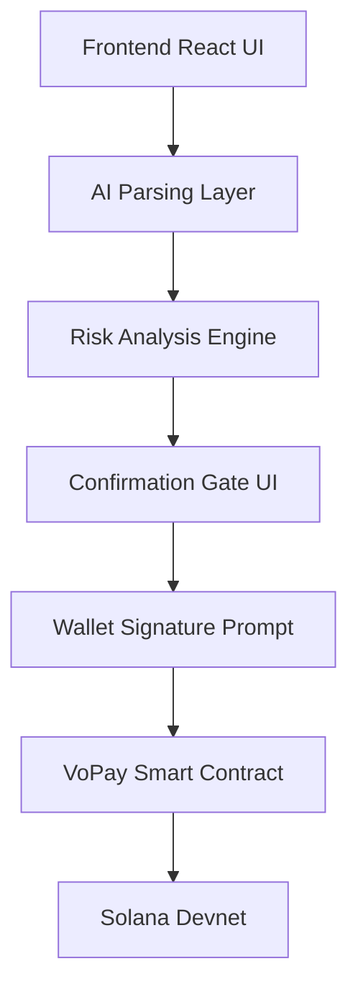

# 🛡️ VoPay — Understood. Signed. Secure.

### **“Understand Before You Sign.”**

VoPay is a voice-first AI transaction safety assistant built on **Solana**. It bridges the gap between complex blockchain transactions and human understanding, providing a security layer that explains, analyzes, and gates transactions before they ever reach your wallet popup.

---

[](https://explorer.solana.com/address/2BqHZjo6i4qGLeqU43KFHeW7qwymY9PXc5J5iXzsrsKK?cluster=devnet)
[](https://openai.com)
[](https://elevenlabs.io)
[](https://www.anchor-lang.com/)
[](https://reactjs.org/)

🚀 **[Live Demo](https://vopay.vercel.app)**  |  📺 **[Demo Video](#-demo-video)**  |  📦 **[GitHub Repository](https://github.com/your-username/vopay)**

---

## 🛑 The Problem

Blockchain interactions are inherently opaque. For most users, signing a transaction is a leap of faith:

*   **Instruction Overload:** Users blindly sign hexadecimal data or complex instructions they don't understand.
*   **Rising Malicious Approvals:** Wallet phishing and drained accounts are at an all-time high, with **$530M+ lost** to scams in the last year alone.
*   **Invisible Permissions:** Many users cannot distinguish between a simple transfer and a dangerous "Set Authority" or "Approve" call.
*   **Network Confusion:** Congestion and varying protocol behaviors make it hard for even experienced users to feel 100% confident.

> **“Blockchain adoption cannot scale safely if users do not understand what they are signing.”**

---

## ✨ Our Solution: VoPay

VoPay is not just a payment app; it is **security infrastructure** for safer blockchain adoption. We introduce an AI-powered voice-first transaction safety layer designed to protect users from the moment they express intent.

*   **AI Interpretation:** High-level natural language explanations of what a transaction *actually* does.
*   **Voice-First Interface:** Speak your intent, and let the AI parse the complexity into clear, actionable data.
*   **Confirmation Gate:** A specialized UI that locks the user into a "Verification State" before any wallet signature is requested.
*   **Safer Mainstream Onboarding:** Removes the technical jargon hurdle by explaining risks in plain English.

---

## 🔄 How It Works

1.  **Connect Wallet:** Seamlessly integrate with Phantom or Solflare.
2.  **Speak or Type:** User provides intent via voice (e.g., *"Send 5 SOL to Victor"*).
3.  **AI Parsing:** AI extracts addresses, amounts, and interprets the underlying protocol intent.
4.  **Risk Analysis:** The system generates a risk level (Low/Medium/High) and a "Safe Passage" explanation.
5.  **Confirmation Gate:** A visual preview of the proposed transaction is displayed.
6.  **Wallet Approval:** The user manually triggers and signs the transaction in their wallet.
7.  **On-Chain Execution:** The VoPay smart contract executes the transfer on Solana Devnet.
8.  **Settlement:** Success screen appears with relevant transaction metadata and explorer links.

---

## 🛠️ Core Features

*   ✅ **Voice-First Flow:** Integrated transcription and AI intent recognition.
*   🤖 **AI Transaction Parsing:** Real-time analysis of transaction payloads.
*   ⚠️ **Risk Level Detection:** Visual badges indicating the safety of the protocol or recipient.
*   🚧 **Confirmation Gate:** Dedicated UI barrier ensuring user attentiveness.
*   🔗 **Smart Contract Integration:** Fully functional Anchor program on Devnet.
*   👛 **Multi-Wallet Support:** Tested with Phantom and Solflare.
*   💾 **Saved Contacts:** Address book for recurring, trusted recipients.
*   📜 **Metadata Logging:** On-chain logging of transaction summaries for auditability.
*   📱 **Responsive Design:** Polished Mobile/Desktop UI with Dark Mode support.

---

## 🛡️ Security Design

**The user is always the final authority.** VoPay is designed with a "Safety-First" philosophy:

*   **No Auto-Signing:** VoPay *never* has access to your private keys and cannot sign transactions automatically.
*   **Manual Trigger:** Every transaction execution must be manually triggered by the user *after* the AI explanation.
*   **Pre-Flight Analysis:** Risk analysis happens *before* the wallet popup appears, preventing heat-of-the-moment mistakes.
*   **Immutable Logic:** The smart contract handles the transfer logic, ensuring funds only move as authorized.
*   **Full Control:** Users see exactly what they are signing before the wallet extension is even invoked.

---

## 💻 Tech Stack

| Component | Technology |
| :--- | :--- |
| **Frontend** | React, Vite, TypeScript, TailwindCSS |
| **Animations** | Motion (formerly Framer Motion) |
| **Blockchain** | Solana, Anchor, @solana/web3.js |
| **Wallet** | Wallet Adapter (Phantom, Solflare) |
| **AI** | Claude 3.5 Sonnet / Gemini (Context/Risk Analysis) |
| **Voice** | Web Speech API / ElevenLabs |
| **Deployment** | Vercel |

---

## 📜 Smart Contract Information

*   **Program ID:** `2BqHZjo6i4qGLeqU43KFHeW7qwymY9PXc5J5iXzsrsKK`
*   **Network:** Solana Devnet
*   **Framework:** Anchor

🔍 **[View on Solana Explorer](https://explorer.solana.com/address/2BqHZjo6i4qGLeqU43KFHeW7qwymY9PXc5J5iXzsrsKK?cluster=devnet)**

The contract supports:
- Native SOL transfers with security gates.
- On-chain transaction metadata logging.
- Risk level verification.

---

## 📐 Project Architecture



---

## ⚙️ Environment Variables

Create a `.env` file in the root directory:

```env
# AI Services
CLAUDE_API_KEY=your_claude_key
ELEVENLABS_API_KEY=your_elevenlabs_key

# Solana Configuration
VITE_SOLANA_RPC_URL=https://api.devnet.solana.com
VITE_SOLANA_NETWORK=devnet
VITE_VOPAY_PROGRAM_ID=2BqHZjo6i4qGLeqU43KFHeW7qwymY9PXc5J5iXzsrsKK
```

⚠️ **Warning:** Never expose your `.env` file or API keys in public repositories.

---

## 🚀 Local Setup

1.  **Clone the Repository:**
    ```bash
    git clone https://github.com/your-username/vopay.git
    cd vopay
    ```

2.  **Install Dependencies:**
    ```bash
    npm install
    ```

3.  **Setup Environment:**
    Copy `.env.example` to `.env` and fill in your keys.

4.  **Run Development Server:**
    ```bash
    npm run dev
    ```

5.  **Connect Wallet:**
    Ensure your Phantom or Solflare wallet is set to **Devnet** and has test SOL.

---

## 📂 Project Structure

```text
├── src/
│   ├── components/       # Visual UI components & Navigation
│   ├── context/          # State management (Theme, Wallet)
│   ├── idl/              # Anchor Program IDL
│   ├── lib/              # Solana utilities & Program helpers
│   ├── pages/            # Main application screens (Landing, Assistant, Dashboard, History)
│   └── App.tsx           # Main routing and structure
├── server.ts             # Express server for AI proxy
├── package.json          # Project dependencies
└── README.md             # You are here
```

---

## 👥 Team

| Role | Responsibility |
| :--- | :--- |
| **Fullstack Developer** | [Your Name/Handle] |
| **Smart Contract Dev** | [Your Name/Handle] |
| **Product Manager** | [Your Name/Handle] |
| **QA / Content** | [Your Name/Handle] |

---

## 🗺️ Future Roadmap

*   🔹 **SPL Token Support:** Multi-asset safety analysis (USDC, BONK, etc).
*   🔹 **Multilingual Voice:** AI translation for global non-English markets.
*   🔹 **Advanced Detection:** AI-powered simulation of transaction outcomes.
*   🔹 **Mobile App:** Native iOS/Android builds for mobile usage.
*   🔹 **Mainnet Deployment:** Scaling for real-world TVL protection.

---

## 💡 Why VoPay Matters

As blockchain moves toward its "Broadband Moment," security cannot be an afterthought. VoPay makes Web3 accessible to everyone by speaking the user's language—literally. By ensuring every user understands the *intent* and *impact* of a signature, we move closer to a decentralized world where security is default, not a feature.

**VoPay: Humanizing the Blockchain Security Interface.**

---
*Built for the Solana Superteam Hackathon.*
